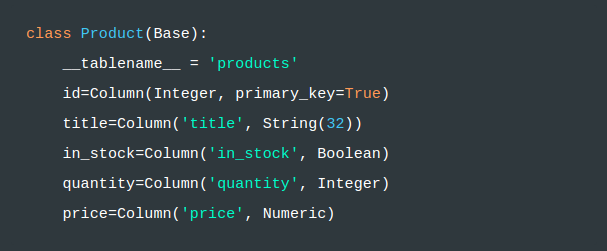

# SQLAlchemy Data Types

Al usar SQLAlchemy, podemos estar seguros de que obtendremos soporte para los tipos de datos más comunes que se encuentran en las bases de datos relacionales. Por ejemplo, los valores booleanos, fechas, horas, cadenas y valores numéricos son solo un subconjunto de los tipos para los que SQLAlchemy proporciona abstracciones. Además de estos tipos básicos, SQLAlchemy incluye soporte para algunos tipos específicos de proveedores (como JSON) y también permite a los desarrolladores crear tipos personalizados y redefinir los existentes.

Para comprender cómo usamos los tipos de datos SQLAlchemy para asignar propiedades de las clases de Python a columnas en una tabla de base de datos de relaciones, analicemos el siguiente ejemplo:

En el fragmento de código anterior, estamos definiendo una clase llamada Product que tiene seis propiedades. Echemos un vistazo a lo que hacen estas propiedades:

- **\_\_tablename__**  le dice a SQLAlchemy que las filas de la tabla de products deben asignarse a esta clase. 

- **id** identifica que esta es primary_key en la tabla y que su tipo es Integer.

- **title** indica que una columna de la tabla tiene el mismo nombre de la propiedad y que su tipo es String.

- **in_stock** indica que una columna de la tabla tiene el mismo nombre de la propiedad y que su tipo es booleano.

- **quantity** indica que una columna de la tabla tiene el mismo nombre de la propiedad y que su tipo es Integer.

- **prince** indica que una columna de la tabla tiene el mismo nombre de la propiedad y que su tipo es Numeric.

Los desarrolladores experimentados notarán que (generalmente) las bases de datos relacionales no tienen tipos de datos con estos nombres exactos. SQLAlchemy utiliza estos tipos como representaciones genéricas de las bases de datos compatibles y utiliza el dialecto configurado para comprender a qué tipos se traducen. Por ejemplo, en una base de datos PostgreSQL, el título se asignaría a una columna varchar.