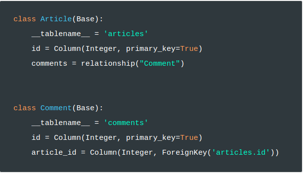
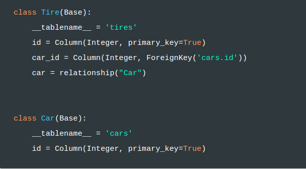

# SQLAlchemy Relationship Patterns

Ahora que sabemos qué es ORM y hemos analizado los tipos de datos, aprendamos cómo usar SQLAlchemy para asignar relaciones entre clases a relaciones entre tablas. SQLAlchemy admite cuatro tipos de relaciones: 

- [uno a muchos](https://docs.sqlalchemy.org/en/13/orm/basic_relationships.html#one-to-many)

- [muchos a uno](https://docs.sqlalchemy.org/en/13/orm/basic_relationships.html#many-to-one)

- [uno a uno](https://docs.sqlalchemy.org/en/13/orm/basic_relationships.html#one-to-one) 

- [muchos a muchos](http://docs.sqlalchemy.org/en/latest/orm/basic_relationships.html#many-to-many)

___

El primer tipo, One To Many, se usa para marcar que una instancia de una clase se puede asociar con muchas instancias de otra clase. Por ejemplo, en un motor de blog, una instancia de la clase **Article** podría asociarse con muchas instancias de la clase **Comment**. En este caso, mapearíamos las clases mencionadas y su relación de la siguiente manera:

___

El segundo tipo, Many To One, se refiere a la misma relación descrita anteriormente pero desde la otra perspectiva. Para dar un ejemplo diferente, digamos que queremos mapear la relación entre las instancias de **Tire** a una instancia de **Car**. Como muchas llantas pertenecen a un automóvil y este automóvil contiene muchas llantas, mapearíamos esta relación de la siguiente manera:

___

El tercer tipo, One to One, se refiere a las relaciones en las que una instancia de una clase particular solo puede asociarse con una instancia de otra clase, y viceversa. Como ejemplo, considere la relación entre **Person** y **MobilePhone**. Por lo general, una persona posee un teléfono móvil y este teléfono móvil pertenece solo a esta persona. Para mapear esta relación en SQLAlchemy, creamos el siguiente código:

~~~
class Person(Base):
    __tablename__ = 'people'
    id = Column(Integer, primary_key=True)
    mobile_phone = relationship("MobilePhone", uselist=False, back_populates="person")

class MobilePhone(Base):
    __tablename__ = 'mobile_phones'
    id = Column(Integer, primary_key=True)
    person_id = Column(Integer, ForeignKey('people.id'))
    person = relationship("Person", back_populates="mobile_phone")
~~~

En este ejemplo, pasamos dos parámetros adicionales a la función de relación. El primero, uselist = False, hace que SQLAlchemy entienda que mobile_phone contendrá solo una instancia y no una matriz (múltiple) de instancias. El segundo, back_populate, indica a SQLAlchemy que complete el otro lado de la asignación. [La documentación oficial de la API de Relaciones ](https://docs.sqlalchemy.org/en/13/orm/relationship_api.html) proporciona una explicación completa de estos parámetros y también cubre otros parámetros no mencionados aquí.

___

El último tipo admitido por SQLAlchemy, Many To Many, se usa cuando las instancias de una clase en particular pueden tener cero o más asociaciones con instancias de otra clase. Por ejemplo, supongamos que estamos mapeando la relación de instancias de Student e instancias de Class en un sistema que administra una escuela. Como muchos estudiantes pueden participar en muchas clases, mapearíamos la relación de la siguiente manera:

~~~
students_classes_association = Table('students_classes', Base.metadata,
    Column('student_id', Integer, ForeignKey('students.id')),
    Column('class_id', Integer, ForeignKey('classes.id'))
)

class Student(Base):
    __tablename__ = 'students'
    id = Column(Integer, primary_key=True)
    classes = relationship("Class", secondary=students_classes_association)

class Class(Base):
    __tablename__ = 'classes'
    id = Column(Integer, primary_key=True)
~~~

Los fragmentos de código anteriores muestran solo un subconjunto de las opciones de asignación admitidas por SQLAlchemy. En las siguientes secciones, vamos a echar un vistazo más profundo a cada uno de los patrones de relación disponibles. Además de eso, [la documentación oficial](http://docs.sqlalchemy.org/en/latest/orm/basic_relationships.html) es una gran referencia para aprender más sobre los patrones de relación en SQLAlchemy.