# Starting the Tutorial Project

 Podemos comenzar a asignar las clases de Python a las tablas de la base de datos. En este tutorial, asignaremos cuatro clases simples que representan películas, actores, especialistas y detalles de contacto. El siguiente diagrama ilustra las características de estas entidades y sus relaciones.

 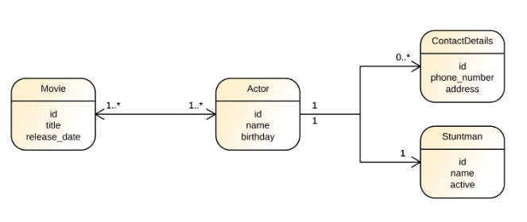

 Para comenzar, crearemos un archivo llamado base.py en el directorio principal de nuestro proyecto y le agregaremos el siguiente código:

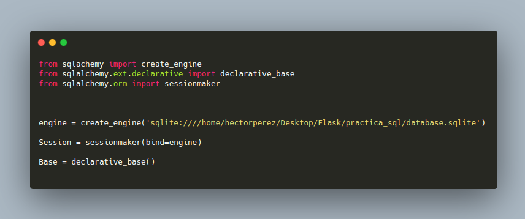

Este código crea:

- un motor SQLAlchemy que interactuará con nuestra base de datos SQLite

- una fábrica de sesión ORM SQLAlchemy vinculada a este motor

- y una clase base para nuestras definiciones de clases. 

___

Ahora creemos y asignemos la clase Movie. Para hacer esto, creemos un nuevo archivo llamado movie.py y agreguemos el siguiente código:

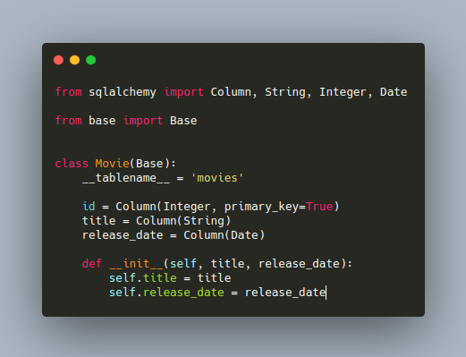

La definición de esta clase y sus características de mapeo es bastante simple. Comenzamos haciendo que esta clase extienda la clase Base definida en el módulo base.py y luego le agregamos cuatro propiedades:

- \_\_tablename__ indica cuál es el nombre de la tabla que admitirá esta clase.

- id representa la llave primaria de la clase 

- title es de tipo String

- relase_date de tipo Date

___

La siguiente clase que crearemos y asignaremos es la clase Actor. Creemos un archivo llamado actor.py y agreguemos el siguiente código:

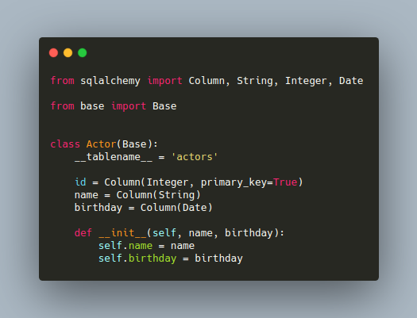

La definición de esta clase es bastante similar a la anterior. Las diferencias son que la clase **Actor** tiene un nombre en lugar de un **título**, un **cumpleaños** en lugar de una **fecha de lanzamiento**, y que apunta a una tabla llamada **actores** en lugar de **películas**.

Como muchas películas pueden tener muchos actores y viceversa, necesitaremos crear una relación de muchos a muchos entre estas dos clases. Creemos esta relación actualizando el archivo movie.py de la siguiente manera:

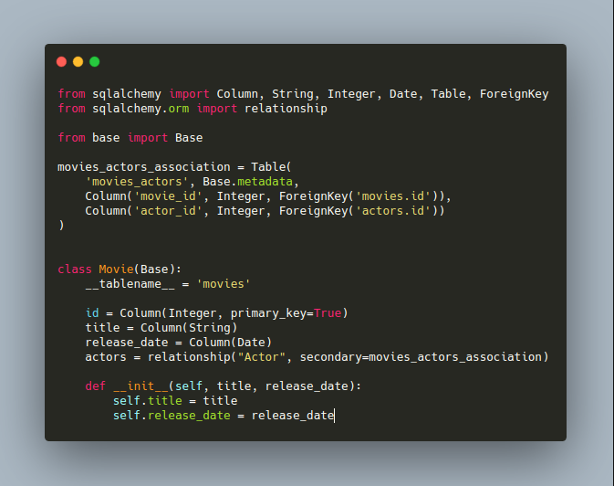

La diferencia entre esta versión y la anterior es:

- Importamos 3 nuevas entidades: **Table**, **ForeignKey** y **relationship**

- creamos una tabla con el nombre **movie_actors_association** que conecta la filas de la tabla **actors** y las filas de **movies**

- Y agregamos la propiedad de **actors** a **Movie** y configuramos **movies_actors_association** como la tabla intermedia.

___

La próxima clase que crearemos es **Stuntman**. En nuestro tutorial, un **Actor** en particular tendrá solo un **Stuntman** y este **Stuntman** solo funcionará con este **Actor**. Esto significa que necesitamos crear la clase **Stuntman** y una relación uno a uno entre estas clases. Para lograr eso, creemos un archivo llamado **stuntman.py** y agreguemos el siguiente código:

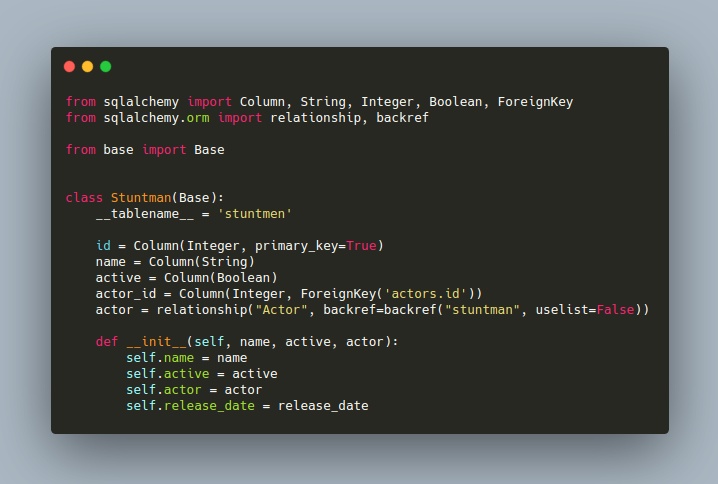

En esta clase, hemos definido que la propiedad del **actor** hace referencia a una instancia de **Actor** y que este **actor** obtendrá una propiedad llamada especialista que no es una lista (uselist = False). Es decir, cada vez que cargamos una instancia de Stuntman, SQLAlchemy también cargará y completará el Actor asociado con este especialista.

___

La cuarta y última clase que asignaremos en nuestro tutorial es **ContactDetails**. Las instancias de esta clase contendrán un **número de teléfono** y una **dirección** de un **Actor** en particular, y un Actor podrá tener muchos ContactDetails asociados. Por lo tanto, necesitaremos usar el patrón de relación Muchos a Uno para mapear esta asociación. Para crear esta clase y esta asociación, creemos un archivo llamado contact_details.py y agreguemos el siguiente código fuente:

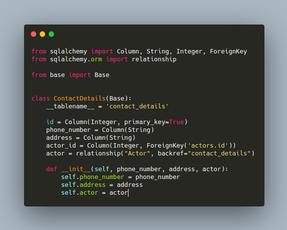

Como podemos ver, crear una asociación Many To One es algo similar a crear una asociación One To One. La diferencia es que en este último le indicamos a SQLAlchemy que no use listas. Esta instrucción termina restringiendo la asociación a una sola instancia en lugar de una lista de instancias.

___

## Datos persistentes con SQLAlchemy ORM

Ahora que hemos creado nuestras clases, creemos un archivo llamado inserts.py y generemos algunas instancias de estas clases para que permanezcan en la base de datos. En este archivo, agreguemos el siguiente código:

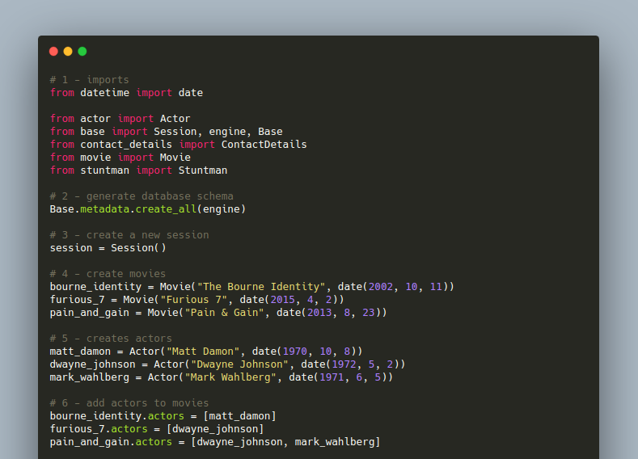
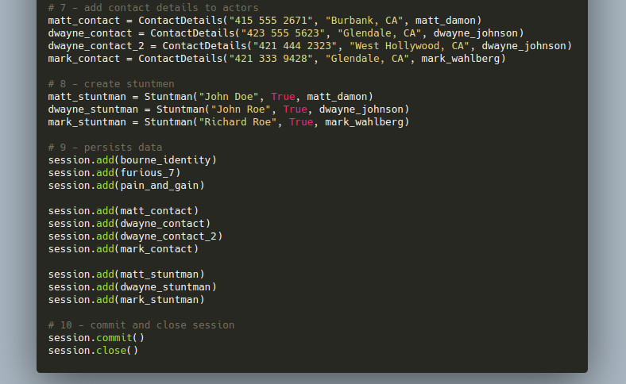

Este código se divide en 10 secciones. Vamos a inspeccionarlos:

1. La primera sección importa las clases que creamos, el motor SQLAlchemy, la clase Base, la fábrica de sesiones y **date** del módulo **datetime**.

2. La segunda sección le indica a SQLAlchemy que genere el esquema de la base de datos. Esta generación ocurre en base a las declaraciones que hicimos al crear las cuatro clases principales que componen nuestro tutorial.

3. The third section extracts a new session from the session factory.

4. La cuarta sección crea tres instancias de la clase **Movie**.

5. La quinta sección crea tres instancias de la clase **Actor**.

6. La sexta sección agrega actores a las películas. Tenga en cuenta que la película Pain & Gain hace referencia a dos actores: Dwayne Johnson y Mark Wahlberg.

7. La séptima sección crea instancias de **ContactDetails** y define a qué actores están asociadas estas instancias.

8. La octava sección define tres especialistas y también a qué actores están asociados estos especialistas.

9. La novena sección usa la sesión actual para guardar las películas, actores, detalles de contacto y especialistas creados. Tenga en cuenta que no hemos guardado explícitamente actores. Esto no es necesario porque SQLAlchemy, por defecto, usa la estrategia de cascada de guardar-actualizar.

10. La décima sección confirma la sesión actual en la base de datos y la cierra.

## Querying Data with SQLAlchemy ORM

Como veremos, consultar datos con SQLAlchemy ORM es bastante simple. Esta biblioteca proporciona una API intuitiva y fluida que permite a los desarrolladores escribir consultas que son fáciles de leer y mantener. En SQLAlchemy ORM, todas las consultas comienzan con un Objeto de consulta que se extrae de la sesión actual y que está asociado con una clase asignada particular. Para ver esta API en acción, creemos un archivo llamado queries.py y agreguemos el siguiente código fuente:

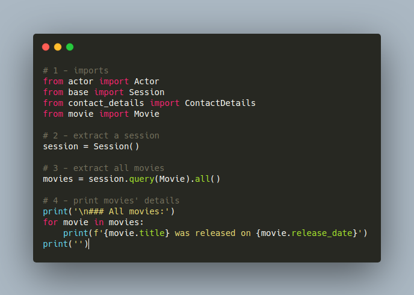

El fragmento de código anterior, que se puede ejecutar con **python queries.py**, muestra lo fácil que es usar SQLAlchemy ORM para consultar datos. Para recuperar todas las películas de la base de datos, solo necesitábamos buscar una sesión de la fábrica de sesiones, usarla para obtener una consulta asociada con **Movie** y luego llamar a la función **all ()** en este objeto de consulta. La API de consulta proporciona docenas de funciones útiles como **all ()**. En la siguiente lista, podemos ver una breve explicación sobre los más importantes:

- count(): Devuelve el número total de filas de una consulta.

- filter(): Filters the query by applying a criteria.

- delete(): Elimina de la base de datos las filas que coinciden con una consulta.

- distinct(): Aplica una [declaración distinta](https://www.w3schools.com/sql/sql_distinct.asp) a una consulta.

- exists(): Agrega un [operador existente](https://www.w3schools.com/sql/sql_exists.asp) a una subconsulta.

- first(): Devuelve la primera fila de una consulta.

- get(): Devuelve la fila a la que hace referencia el parámetro de clave primaria pasado como argumento.

- join(): Crea una [unión SQL](https://www.w3schools.com/sql/sql_join.asp) en una consulta.

- limit(): Limita el número de filas devueltas por una consulta.

- order_by(): Establece un orden en las filas devueltas por una consulta.

Para explorar el uso de algunas de estas funciones, agreguemos el siguiente código al script queries.py:

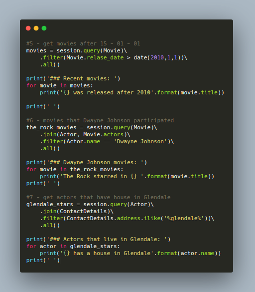

La quinta sección del script actualizado utiliza la función **filter ()** para buscar solo películas que se lanzaron después del 1 de enero de 2015. La sexta sección muestra cómo usar **join ()** para obtener instancias de **Movie** en las que participó el actor Dwayne Johnson. La séptima y última sección muestra el uso de las funciones **join ()** e **ilike ()** para recuperar actores que tienen casas en Glendale.

Ejecutar la nueva versión del script (python queries.py) ahora generará el siguiente resultado:

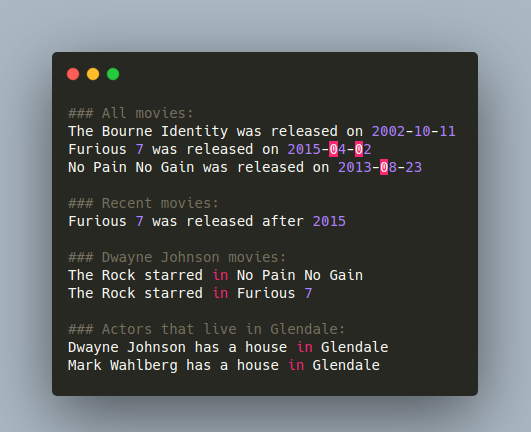

Como podemos ver, el uso de la API es sencillo y genera un código que es legible. Para ver otras funciones compatibles con la API de consulta y su descripción, eche un vistazo a la [documentación oficial](https://docs.sqlalchemy.org/en/13/orm/query.html).